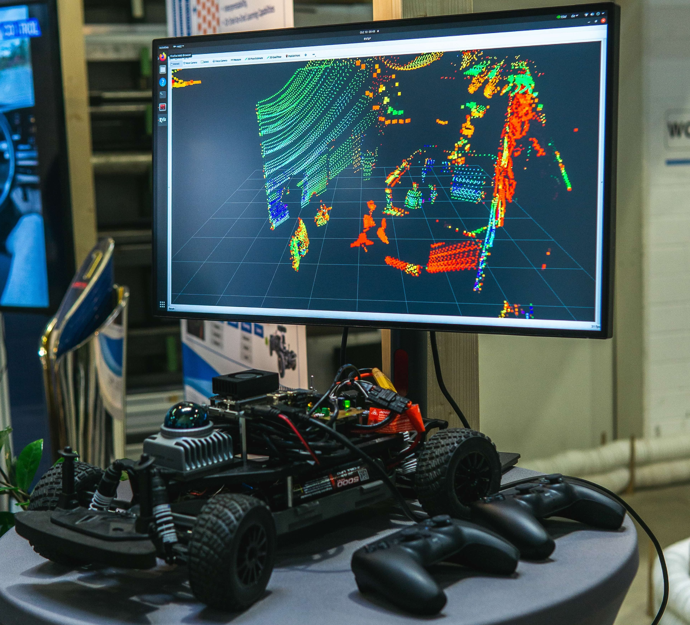

# 3D LiDAR SLAM and Localization on F1TENTH

<p align="center">
  
</p>


This repository provides the necessary drivers to operate the F1Tenth/RoboRacer cars equipped with the Livox MID-360 3D LiDAR sensor ([Livox MID-360 product page](https://www.livoxtech.com/de/mid-360)). Additionally, we include a robust and tested 3D LiDAR SLAM package specifically validated for use with this LiDAR.

The provided setup is designed not to interfere with your existing workspace. This means switching between the original 2D sensor and the new 3D sensor is as easy as modifying your launch command.

The following instructions where tested and verifies on the following hard- and software on the 10th of March 2025

- Jetson Orin Nano 8GB Development Kit
- Jetpack 5.1.2

You can find videos demonstrating the raw LiDAR data as well as 3D SLAM performance, as well as 3 rosbags via the following link: [TUM SyncAndShare](https://syncandshare.lrz.de/getlink/fiCk878yuz8FvFnavZWunU/Livox_LiDAR)

## Setup
1. 3D print the Livox mounting plate: [STL File](https://github.com/TUM-AVS/F1TENTH-Auxiliaries/tree/main/F1TENTH%20-%20CAD%20Files/Livox%20MID-360%20Adapter%20Plate).
2. Attach the LiDAR to the plate, using the screws included in the MID-360 package.
3. Press 4 M3 DIN 934 Hex Nuts into the respective places on the plate.
4. Use 4 M3x16mm (e.g., DIN 912 or ISO 4762) screws to mount the plate and the LiDAR on the F1Tenth platform.
5. Attach the power connectors of the LiDAR to the powerboard and the Ethernet cable to the Jetson. Take special attention to the polarity of the cables and your specific powerboard. Please thoroughly evaluate if you can use the LiDAR with your powerboard before first use.  
6. Note down the IP-adress of your Livox LiDAR: "192.168.1.1XX". Replace XX with the last two numbers of the LiDAR Serial Number, which can be found on a QR Code sticker on the back of the device (see "Livox_SerialNumber.jpeg").

## Installation - Livox Driver

1. Create a new workspace for this project, add a `src` directory and clone this repository into it:
```
mkdir -p ~/f1tenth_ws_3dlidar/src
cd ~/f1tenth_ws_3dlidar/src
git clone https://github.com/TUM-AVS/RoboRacer-3DLiDAR.git
```
2. Run `./install.sh` from this directory. 
3. Activate the new "Livox" network profile.
4. Ping the LiDAR-sensor in the terminal to verify a successfull connection (replace XX with the same values as above):
```
ping 192.168.1.1XX
```
5. Substitute the LiDAR IP in `livox_ros_driver2/config/MID360_config.json` by changing "XX" to the last two digits of the LiDAR Serial Number, which can be found on a QR Code sticker on the back of the device.
6. Build the workspace in the main directory and source it (This can take up to 10 minutes.):
```
source ~/.bashrc
cd ..
colcon build
source install/setup.bash
```
7. Rebuild the `f1tenth_stack` from `~/f1tenth_ws`:
```
cd ~/f1tenth_ws
colcon build --packages-select f1tenth_stack
source install/setup.bash
```

## Running the Code - Livox Driver
Launch the modified `f1tenth_stack` with
```
cd ~/f1tenth_ws
source install/setup.bash
ros2 launch f1tenth_stack bringup_launch_mid360.py
```
## Installation - 3D LiDAR SLAM

Please install the **ROS2 3D LiDAR SLAM** ROS package according to the instructions inside the **lidarslam_ros2** folder.


## Running the Code - 3D LiDAR SLAM
**Note: To transfer maps between Mapping and Localization, the car must start in the same position for when the respective nodes are launched. Depending on the environment, there may be some room for error in initial positioning.**
### Mapping
To run the SLAM Mapping Task and generate a Map, run
```
cd ~/f1tenth_ws
source install/setup.bash
ros2 launch lidarslam lidarslam.launch.py
```
from the Workspace root directory. The topics `map, modified_map, path, modified_path` and `current_pose` are available in `rviz2` for visualization and further processing. Here, the "modified" topics are generated through additional loop closure. \
Map Saving can be manually triggered with `ros2 service call /map_save std_srvs/Empty` with or without loop closure. \
The node will overwrite the `map.pcd` file on the next startup, so it must be moved or archived if its data is to be kept for Localization or Viewing. Archiving generated maps in the `~/[3D SLAM WS]/map/` directory may be convenient.

### Localization
To perform Localization, first, copy the map to be used to `~/[3D SLAM WS]/map/map.pcd`, where it will then be loaded from upon node launch:
```
ros2 launch scanmatcher_custom mapping_robot.launch.py 
```
The topics `map, path` and `current_pose` are available in `rviz2` for visualization and further processing.

## Configuration
Config files are available in `lidarslam_ros2/lidarslam/param/lidarslam.yaml` for SLAM and `scanmatcher_custom/param/mapping_robot.yaml` for Localization. For Information about configs see `lidarslam_ros2/README.md`.

## Common Errors
From the [livox_ros_driver2](https://github.com/Livox-SDK/livox_ros_driver2/tree/master):
Please add '/usr/local/lib' to the env LD_LIBRARY_PATH.

* If you want to add to current terminal:

  ```shell
  export LD_LIBRARY_PATH=${LD_LIBRARY_PATH}:/usr/local/lib
  ```

* If you want to add to current user:

  ```shell
  vim ~/.bashrc
  export LD_LIBRARY_PATH=${LD_LIBRARY_PATH}:/usr/local/lib
  source ~/.bashrc
  ```

## Acknowledgements

The TUM F1Tenth/RoboRacer project is lead by Felix Jahncke ([Website](https://www.mos.ed.tum.de/en/avs/team/felix-jahncke/)) at the Professorship of Autonomous Vehicle Systems under the supervision of Professor Johannes Betz ([Website](https://www.mos.ed.tum.de/en/avs/team/prof-dr-ing-johannes-betz/)).

We thank Moritz Wagner and Ahmad Amine ([Website](https://ahmadamine998.github.io/)) for their contributions.

